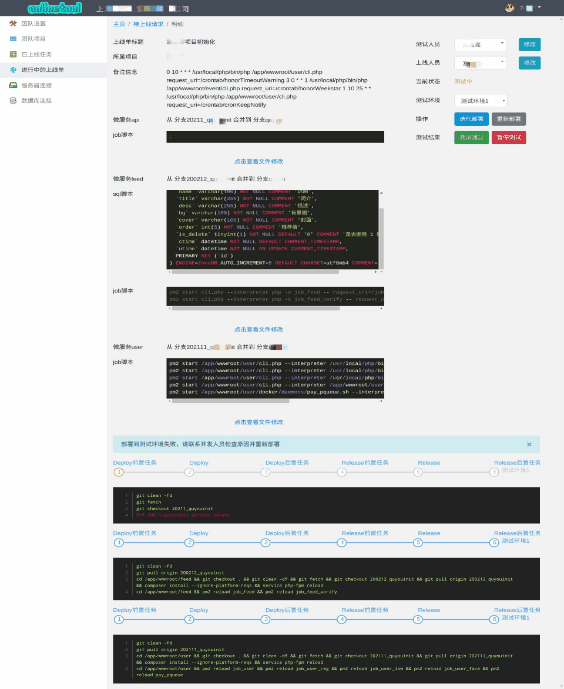

## 流刀上线工具客户端

##### 流刀上线工具客户端是什么？

使用过 [gitlab](<https://gitlab.com/>) [cicd](<https://docs.gitlab.com/ee/ci/>) 功能的朋友应该都知道，这是gitlab提供的能够在你提交代码时触发的持续集成功能。使用cicj需要在您服务器的内网中安装一个 [runner](https://docs.gitlab.com/runner/install/)。流刀上线工具客户端的作用和这个runner其实差不多，是帮助您团队实现在测试、预发布、线上环境进行部署的一个工具

##### 流刀上线工具和gitlab的cicj有什么区别？和 [瓦力部署系统](http://walle-web.io/) 又有什么区别？

无论是瓦力还是cicj，重点都放在了部署上，且重点都放在了代码级别的部署上。cicj相对来说功能更强大，但配置繁琐。cicj的语法规则非专业人事很难配置。流刀上线工具 [<http://h5.companyclub.cn/>](http://h5.companyclub.cn/) 相对他们来说除了能够完成代码级别的部署功能以外，还拥有以下特色：

1. 上线流程规范化
	互联网公司的核心是软件产品，软件产品的迭代重点是流程。从pm提出需求到程序员实现需求，然后测试去进行功能把关，代码review人员进行代码把关，必要时进行预发布环境的测试，最后进行上线流程并通知pm。这一系列的过程都需要严格的流程管控。流刀上线工具则将这种流程固化了下来，程序员提交上线单点击开始测试按钮后，会以钉钉、企业微信、邮件的方式通知测试人员，测试人员测试完成，点击通过按钮时候，也会同样的触发这一流程推送到上线人员那里，直到最后代码上线。
2. 更适用于微服务批量上线的场景
	无论是瓦力还是gitlab，都是把单个git资源作为独立的上线模块看待。然而在微服务场景下，每个版本的更新迭代需要上线的微服务少则六七个，多达十几个，为了走完整个上线流程真是苦不堪言。流刀上线工具解决该问题的方式是：程序员提交的上线单包含了需要上线的一系列微服务（git库），无论是测试人员部署到测试环境还是上线人员把他部署到预发布、线上环境，都是以上线单为单位，对上线涉及到的这一系列的微服务实行并发部署方式，缩减上线所需要消耗的时间。
3. 不只是代码级别的上线
	程序员提交的上线单中还可以包含数据库的操作内容，job（常驻脚本）的操作内容（创建、重启）。通过流刀上线工具会在合适的时间点自动进行数据库、job的相关操作。这恐怕是你用任何一种上线工具都无法提供的功能点吧～

#### 体验账号

地址：<http://h5.companyclub.cn/login>  账号：test@qq.com  密码：Test123456 




### 主要功能：

- 项目/微服务管理

  每个项目由一个或多个微服务构成。

  微服务管理 可以配置微服务名称、git文件夹目录、主分支、线上服务器、线上数据库、部署目录、打包前执行的名称、需要打包的目录、打包排除文件、部署后执行命令等。

  

- 提交上线单

  勾选该项目下需要上线的微服务，填写微服务需要上线的分支，如需在线上建表，可填写sql语句。另外也支持配置job服务器执行job指令等。

- 完整的上线流程管控

  提交上线单->部署到测试环境->测试环境测试通过->部署到预发布环境->预发布环境测试通过->代码上线。

  全流程自动化。各流程通过企业微信/钉钉进行通知相关人员。

  

  

### 使用流程：

  1. 注册账号 [点击跳转到 流刀上线工具 注册](http://h5.companyclub.cn/)

  2. 部署客户端工具（参照下面的方法在自己团队的服务器上部署客户端工具，并开放9535端口对团队成员开放）

  3. 在网页 团队设置 - 客户端 中填写 客户端工具部署的对团队成员开放的ip和端口号。

  4. 创建项目。

    创建时可以填钉钉、企业微信的机器人hook，上线工具用于团队成员自动发布各种通知。
    创建完成后进行到项目中的项目设置页面，需要填写项目的开发、测试、上线人员（可以是同一个人）。

  5. 创建微服务。

    在创建该微服务之前，先登录到您安装客户端工具的那台服务器，cd 到 /usr/local/onlinetool/reponsitory/ 目录下（无论你是用那种方式安装的客户端工具，运行后都会自动创该目录的）。执行类似如下命令 `git clone [该微服务的地址] -b [微服务的主分支] [项目名（英文）]_[微服务名（英文）]`
    创建微服务时的 **git文件夹目录** 填写上面的  **[项目名（英文）]_[微服务名（英文）]`** ,创建微服务时会涉及到您填写测试、预发布、线上环境服务器、数据库的连接信息，不用担心这些隐私泄露的问题，因为这心内容不会上传到平台，保存在您运行客户端工具的服务器上的的 `/usr/local/onlinetool/config` 文件中。其他内容根据您团队项目的实际情况填写。

  6. 提交上线单。 

    在项目左侧的列表中点击提交上线单，主要填写的内容是您本次上线的内容描述，需要上线的微服务，每个微服务需要上线的分支，这个微服务上线前需要执行哪些sql语句。上线完成之后需要创建、重启哪些job等。
    上线工具会将上线流程推送到测试人员那边，有他选择测试环境进行自动部署，测试人员点击测试通过后会推送到上线人员那里，由他来决定是否在预发布环境测试或者直接上线。


### 问答：

  1. 上线工具上线的原理是什么？

     在测试、预发布环境部署是通过连接到部署的服务器，执行分支切换脚本、源代码编译脚本以及job相关脚本进行部署的。在线上服务器部署，我们在客户端服务器上进行分支合并、代码编译最后将部署内容打包成tar包，分发到需要部署的每一台服务器上。最后进行压缩包的解压部署流程。

  2. 如何进行迭代部署？如何进行重新部署？

     在测试、预发布、线上每一次部署之前，我们都会在客户端机器下记录当前git的commitID,当前部署已经成功执行掉的sql语句，已经成功创建的job。无论是迭代部署还是重新部署，已经执行过的sql语句都不会重复执行，已经创建的job也不会重复创建（但会重新reload相关job）。迭代部署相对于重新部署，会检测对应git的commitID是否发生变化，只部署在上次部署之后，发生过代码变化的分支，也只执行之前没有执行过的sql语句和job脚本。   

  3. 可能存在哪些问题？

     该部署工具在原理上参照  [瓦力上线工具](http://walle-web.io/) ，是通过在目标服务器上创建文件的方式进行部署，可能存在上线过程中出现线上服务有报错的情况。因此，应尽量避免业务访问高峰时上线代码。同时，如果做好负载均衡，通过切换部署服务器的方式也可以避免这样的问题。     

### 客户端工具部署方式：
从发布页面下载jar包：<https://gitee.com/onlinetool/liudao/releases> ,然后有两种方式可供选择。

- 自己安装jdk进行部署

  1. 下载jdk1.8以上
  2. 创建/usr/local/onlinetooll文件夹 `mkdir /usr/local/onlinetool && chown -R [当前用户名]:[当前用户所在的组] /usr/local/onlinetool`
  3. 运行下载的jar包。`nohub java -jar onlinetool_client-1.0.1.jar &`

- 使用docker部署

  1. Dockerfile 内容如下（读者根据实际情况进行修改）：

       ```dockerfile
       FROM openjdk:8-jdk-alpine
       VOLUME /tmp
       ADD ./.ssh /root/.ssh
       ADD onlinetool_client-1.0.1.jar app.jar
       EXPOSE 9535
       # 这是我为了远程调试用的的
       # EXPOSE 5005
       # ENTRYPOINT ["java", "-Xdebug", "-Xnoagent", "-Djava.compiler=NONE", "-Xrunjdwp:transport=dt_socket,address=5005,server=y,suspend=n", "-jar", "/app.jar"]
       ENTRYPOINT ["java","-Djava.security.egd=file:/dev/./urandom","-jar","/app.jar"]
       ```

       

  2. 编译镜像 `docker build -t onlinetool_client .`

  3. 运行容器 `docker run -it -d -p 9535:9535 -v /usr/local/onlinetool:/usr/local/onlinetool onlinetool_client`

### 联系我

使用中有任何问题可以直接与我沟通，微信如下：


  